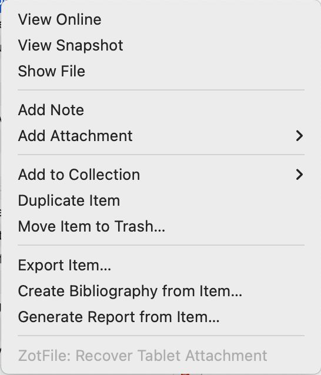

# ZotFile Recovery

Unfortunatly, ZotFile is not compatible with Zotero 7 and most likely never will be. Several alternative projects implement some of ZotFile's functionality for Zotero 7. Take a look at [Zotero File](https://github.com/MuiseDestiny/zotero-file) and [ZotMoov](https://github.com/wileyyugioh/zotmoov).

One of zotfiles features might make certain files inaccesible from Zotero 7. This problem impacts users who send and get files from the tablet (optional setting under "Tablet Settings") and have set the ".tablet.mode" setting to 1, which is the default called "background mode" in the documentation. While these tablet still exist in the tablet folder specified in the zotfile settings, you won't be able to access them from Zotero 7. To address this problem `ZotFile Recovery` adds a menu item to Zotero 7 to recover files from the tablet. This menu item is disabled (as in the screenshot below) unless you select an attachment with an impacted tablet file. Similar to the ZotFile function "Get from Tablet", this function removes the tablet file from the tablet location.

Please use the issue tracker for this GitHub repro to report any bugs.

